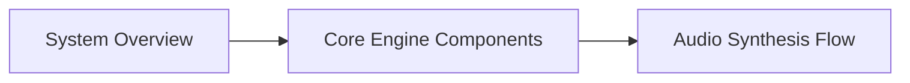
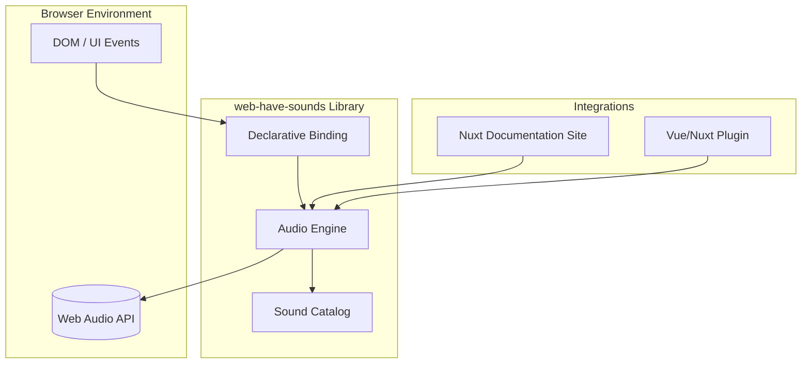
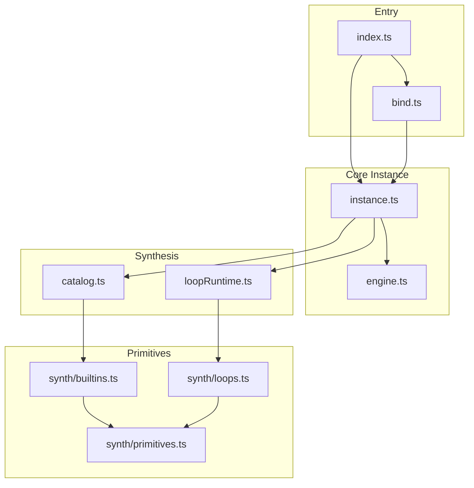
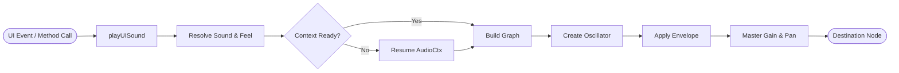

# web-have-sound

## Navigation

<!-- diagram:overview:system -->
## System Overview

<!-- diagram:component:engine -->
## Core Engine Components

<!-- diagram:dataflow:synthesis -->
## Audio Synthesis Flow

